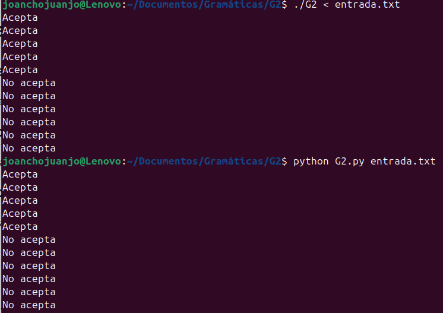
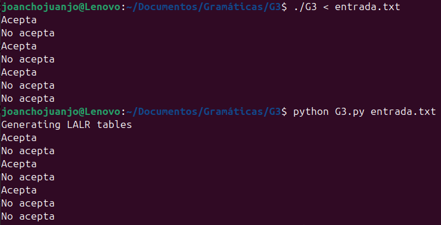
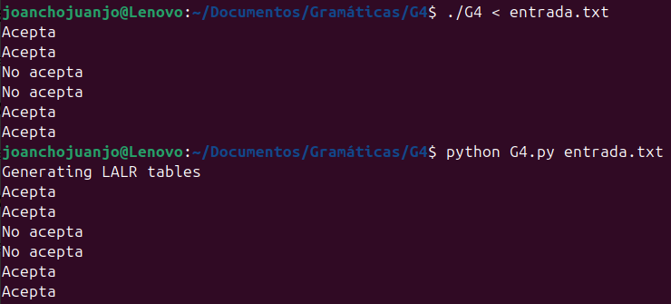
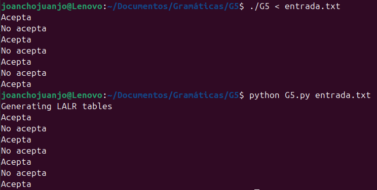

# Gramaticas

###  G1. Cadenas Capicúas

Analiza si una cadena de 0s y 1s es capicúa (se lee igual de izquierda a derecha).

### G2. a^nb^n+1

Valida cadenas con n 'a's seguidas de n+1 'b's, donde n >= 0.

### G3. a^nb^n+1

Valida cadenas con n 'a's seguidas de n+1 'b's, donde n > 0.

### G4. abb | ab

Valida si una cadena es exactamente "abb" o "ab".

### G5. a(ab)^nb

Valida cadenas que comienzan con 'a', seguidas de n repeticiones del bloque "ab", y terminan con una 'b'.

## Cómo Compilar y Ejecutar

Clonar el repositorio:

git clone https://github.com/juancarov/Gramaticas/

Compilar el proyecto (ejemplo con G5):

### Versión C 

make G5
./G5 <entrada.txt>

### Versión Python 

python analizador.py <entrada.txt>
